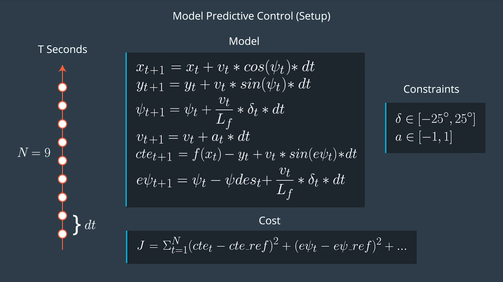
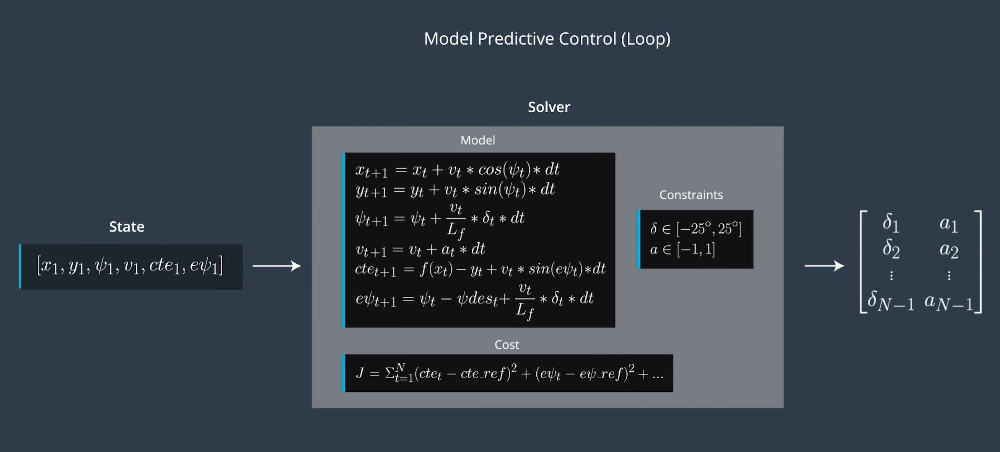
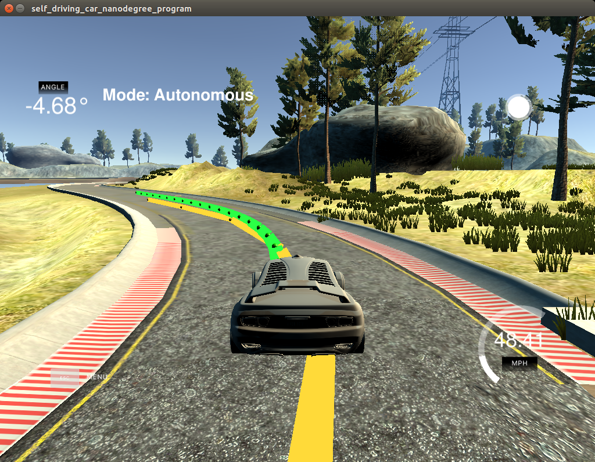

# CarND-Controls-MPC
The task of this project is to implement Model Predictive Control to drive a car around the track.

## The Model
The state for a Model Predictive Control consists of six values:

* the state of the global kinematic model:
  * positions `x` and `y`
  * orientation angle `psi`
  * speed `v`
* the difference to the intended trajectory:
  * cross track error `cte`
  * orientation error `epsi`.

There are two actuator values, which are calculated by the MPC loop taking into account their physical limitations:

* steering angle `delta` (limited +/- 25°)

* acceleration / braking `a` (limited +/- 1).

The update equations for the global kinematic model are given by plain physics. There is one parameter `L_f`, which renders the fact, that a bigger car has a slower turn rate. The update equations for errors are a little bit more complicated. Their derivation can be looked up in lecture notes.

MPC realizes its control function by minimizing a cost function over a pre-defined time horizon (`N` for number of time steps and `dt` for duration of one time step). Therefore it is also known as *Receding Horizon Control*. The cost function is the sum of different components with different weights:

* cross track error `cte` (obviously)
* orientation error `epsi` (obviously)
* reference velocity or distance to destination to avoid stopping of vehicle
* steering angle `delta` for smoother lane change
* acceleration / braking `a` for smoother acceleration or braking

 The complete model setup can be seen in this picture:

## Timestep Length and Elapsed Duration (N & dt)
For driving a car the time horizon should not be greater than a few seconds, because after this period the environment has changed significantly. Choosing `N` and `dt` is a tradeoff between better approximation and lower computational cost.

For a first try I decided to coose a time horizon of one second with number of steps `N` = 20 (`dt` = 0.05 ms).

## Polynomial Fitting and MPC Preprocessing

The waypoints have been transformed from world to vehicle reference. For polynomial fitting a 3rd order polynomial has been used.

## Model Predictive Control with Latency

Model Predictive Control has been implemented with a cost function, which considers following parts (sequence is in descending order of weights):

* change of steering angle `delta'`
* cross-track error `cte`
* orientation error `epsi`
* steering angle `delta` in respect to vehicle velocity `v`
* acceleration / braking `a`
* steering angle `delta`
* change of acceleration / braking `a'`
* difference of vehicle velocity `v` to reference speed `ref_v`

The order of weights was obvious, since it was most important to keep the vehicle at a straight direction and in the middle of the track. All the weight values have been manually determined by try and error. Final values can be seen in source code.

The latency of 100 ms has been taken into account by using this value for calculating next vehicle state.

## Result

The vehicle successfully drove several laps around the track at almost 50 mph. It's even possible to drive at almost 80 mph, but then the wheels start touching the track boundaries. I am sure this can be improved by further tweaking the cost function.

